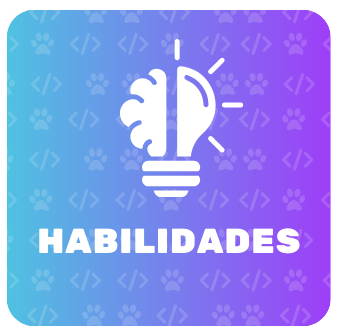

    

 - 🌍Sou brasileira;
 - 📚💻Formada em T.I (técnico em informática) no CEFET-RJ.
 - 📚💻Graduanda em Ciência da computação pela Universidade Estácio de Sá.
 - 📚👩🏻‍🎓Licenciatura em Matemática pela Universidade Federal Fluminense.
 - 👩🏻‍💻Adoro programação e design.👩🏻‍🎨

<!--
    
-->
    
     

## Contato 📲: 

    
    
    
    

## Estatísticas 📊:

