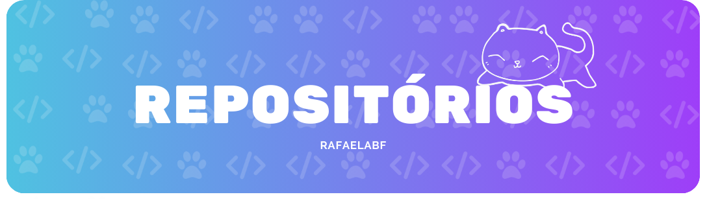

    

Para ajudar outras pessoas a encontrar meus projetos, eles estão divididos em tópicos com suas descrições.

## Mini-Projetos ⚙️
- [Hello Word][9]
  - Para manter a tradição.
  -   
- [Bhaskara][10]
  - Programa em python que recebe uma equação 2° grau completa e retorna as raízes, os vértices, a forma fatorada e concavidade da parábola.
  - 
- [Caderno][11]
  - Aqui faço anotações de aprendizados que tive em cursos e livros separados em tópicos. Em geral tudo voltado a tecnologia.
  - 

## Trabalhos do CEFET 💻
Reposítorios, com projeto ou explicações, que fiz enquanto estava no meu técnico em informática no CEFET-RJ. 

- [P.O.O][1]
  - Repositório destinado as aulas de Programação orientada a objeto (P.O.O) no CEFET-RJ.
  -   
- [Programação C][2]
  - Repositorio para salvar as anotções da aula de Tópicos especiais em programção.
  - 
- [Projeto Grandes A(l)titudes][3]
  - Projeto destinado a criação do site para a ONG Grandes A(l)titudes.
  -      
- [Central 1B][4]
  - Esse repositório tem como finalidade expor o trabalho feito em grupo para disciplina de fundamentos de desenvolvimento para internet do CEFET-RJ no ano letivo de 2021.
  -   
- [Exercícios de Python][5]
  - Esse repositório tem como finalidade expor os trabalhos feitos em grupo para disciplina de Algoritmos computacionais e estruturais do CEFET-RJ no ano letivo de 2021.
  - 
- [Projeto Horta][6]
  - Projeto de um site de horta feito para disciplina de Fundamentos da Internet do CEFET-RJ no ano letivo de 2021.
  -    
- [Brother of Joel][7]
  - Projeto de um jogo feito para disciplina de Introdução a programação do CEFET-RJ no ano letivo de 2020.
  - 
- [Jogo Genius][8]
  - Projeto de um jogo genius feito para disciplina de Introdução a programação do CEFET-RJ no ano letivo de 2020.
  - 
  

[1]: https://github.com/RafaelaBF/P.O.O?tab=readme-ov-file#poo
[2]: https://github.com/RafaelaBF/Programacao_C?tab=readme-ov-file#programacao_c
[3]: https://github.com/RafaelaBF/Site-ONG?tab=readme-ov-file#projeto-grandes-altitudes-%EF%B8%8F
[4]: https://github.com/RafaelaBF/Central1B?tab=readme-ov-file#central-1b
[5]: https://github.com/RafaelaBF/Exercicios_Python_Grupo?tab=readme-ov-file#exerc%C3%ADcios-de-python
[6]: https://github.com/RafaelaBF/Projeto_horta?tab=readme-ov-file#projeto_horta-
[7]: https://github.com/RafaelaBF/Brother-of-Joel?tab=readme-ov-file#brother-of-joel-%EF%B8%8F
[8]: https://github.com/RafaelaBF/Jogo-Genius?tab=readme-ov-file#jogo-genius-
[9]: https://github.com/RafaelaBF/HelloWorld?tab=readme-ov-file#helloworld
[10]: https://github.com/RafaelaBF/Bhaskara_Python?tab=readme-ov-file#bhaskara-
[11]: https://github.com/RafaelaBF/Caderno?tab=readme-ov-file#caderno-